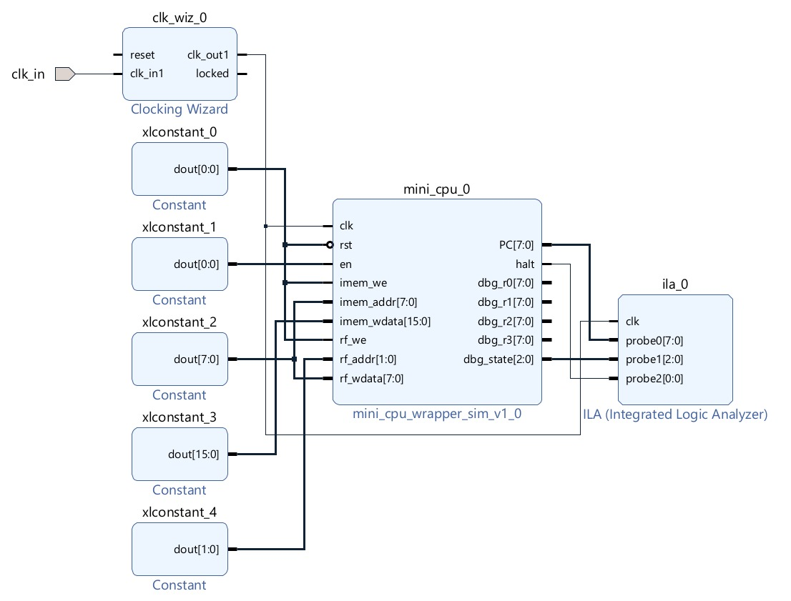
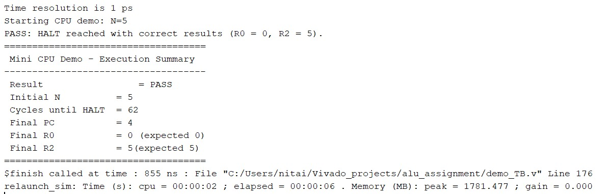

# mini-cpu-verilog
End-to-end RTL project: an 8-bit FSM-based Mini CPU in Verilog, including datapath and control design, branching and HALT implementation, professional self-checking verification, and Vivado IP core packaging and block design integration.

# Mini CPU – Verilog RTL Project

An educational yet engineering-oriented **8-bit Mini CPU** implemented in Verilog.  
The project demonstrates full RTL design ownership, including datapath, control FSM,
branching, HALT handling, verification, and IP packaging flow.

---

## ✨ Key Features

- 8-bit data path, 16-bit instruction width  
- FSM-based control (no pipeline)  
- Separate FETCH / DECODE / EXEC / WB / HALT states  
- Register file with 4 general-purpose registers  
- Branching support (BNE)  
- Real HALT state (CPU stops execution)  
- Self-checking testbench  
- Packaged as a Vivado IP core  

---

## 🧱 Architecture Overview

- **Data Width:** 8 bits  
- **Instruction Width:** 16 bits  
- **Program Counter (PC):** 8 bits  
- **Instruction Memory:** 256 × 16  
- **Register File:** 4 × 8-bit registers  

### FSM States

FETCH → DECODE → EXEC → WB → FETCH
                   ↓
                  HALT

---

## 📐 Instruction Format

[15:12] => opcode
[11:10] => rd
[9:8]   => rs
[7:0]   => imm8

---

## 🧠 Supported ISA

| Opcode | Instruction     | Description          |
|--------|-----------------|----------------------|
| ADD    | ADD rd, rs      | Register addition    |
| ADDI   | ADDI rd, imm    | Immediate addition   |
| SUB    | SUB rd, rs      | Subtraction          |
| CMP    | CMP rd, rs      | Compare (flags only) |
| BNE    | BNE rd, rs, imm | Branch if not equal  |
| HALT   | HALT            | Stop CPU execution   |

---

## 🧪 Verification

The project includes a **self-checking testbench** that:

- Initializes instruction memory and registers  
- Executes a loop using BNE  
- Verifies correct HALT behavior  
- Checks final register values  
- Detects timeout conditions  

### Demo Program

R0 = N
R1 = 1
R2 = 0

loop:
ADDI R2, 1
SUB R0, R1
BNE R0, R3, loop
HALT

Expected result:

- R0 = 0  
- R2 = N  
- CPU enters HALT state  

---

## 📁 Repository Structure

mini-cpu-verilog/
│
├── rtl/
│ ├── mini_cpu.v
│ └── mini_cpu_wrapper_sim.v
│
├── tb/
│ └── mini_cpu_demo_TB.v
│
├── docs/
│ └── images/
│ ├── Block_Diagram_Full_System.jpeg
│ └── Simulation_Waveform.jpeg
| └── TCL_Console_results.jpeg
│
└── README.md

---

## 🖼️ Visuals

### Full System Block Diagram
Mini CPU packaged as a Vivado IP and integrated in a block design.

### Simulation Waveform
Simulation showing Full system operation, PC progression, register updates, and HALT behavior.

### TCL Console Results
Self-checking testbench output demonstrating successful execution and PASS indication.

---

## 🛠 Tools

- Verilog HDL  
- Xilinx Vivado  

---

## 🎯 Project Goal

This project was built as a **learning and demonstration platform** for RTL design,
verification, and system-level thinking, and is suitable for discussion in FPGA / RTL
design interviews.
